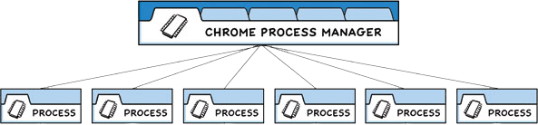

# Electron——创建第一个应用程序

暑期的时候想用 QT 编写一个直播监控工具，还能实时切片的那种，因为想自己写一个比较美观，然后内存占用量比较小的程序。后来惊恐的发现~水平根本不到家~有一些相关的界面凭借自己的实力还没有办法写出来，主要是想调用 OpenGL 接口，但是根本没有什么好的办法去实现它。所以没有办法，还是用自己写项目最熟悉的前端来吧。不过有一点，因为自己原本想写的是应用程序，最后也不想部署到网页上(以后可能会部署的)，而且越来越多的应用开始使用 electron 技术栈编写，干脆自己就学一下 electron 技术栈吧。所以有了今天的这篇文章。

## electron 的安装

首先跟着文档一步一步的开始，网上的学习视频虽然很丰富，但是根本不适合自己去理解，跟着文档学习是一步非常重要的能力。
第一步当然是创建一个项目文件

```bash
mkdir my-electron-app && cd my-electron-app
pnpm init
```

在项目文件创建完毕之后，进去看一下`package.json`文件

原本的应该是这样

```json
{
  "name": "my-electron-app",
  "version": "1.0.0",
  "description": "Hello World!",
  "main": "index.js",
  "scripts": {
    "test": "echo \"Error: no test specified\" && exit 1"
  },
  "author": "Jane Doe",
  "license": "MIT",
  "devDependencies": {
    "electron": "23.1.3"
  }
}
```

改一下

```json
{
  "name": "my-electron-app",
  "version": "1.0.0",
  "description": "Hello World!",
  "main": "main.js",
  "scripts": {
    "test": "echo \"Error: no test specified\" && exit 1"
  },
  "keywords": [],
  "author": "FATFATHAO",
  "license": "MIT",
  "devDependencies": {
    "electron": "^39.2.6"
  }
}
```

去 github 官方仓库里面找一下 [Node.js 的 gitignore 文件](https://github.com/github/gitignore/blob/main/Node.gitignore)
接着就是运行 Electron 应用了，不过这里有 Electron 进程模型的介绍，同时因为自己也只是前端项目做的比较多，能写个一两笔，一些理论基础和架构的相关知识还是比较薄弱的，所以可以借这个机会好好的学习一下。

## 流程模型

在 Chromium 中，存在一个叫做多进程架构的东西，而 Electron 继承了 Chromium 的多进程架构，这就使得 Electron 在架构上非常类似于一个现代的网页浏览器。

### 为什么不是一个单一的进程呢？

网页浏览器是一个极其复杂的应用程序，除了显示网页内容的主要能力之外，他们还有很多次要的职责，例如：管理众多窗口(或者标签页)和加载第三方扩展等。

在早期的时候，浏览器通常使用单个进程来处理所有这些功能，虽然这种模式意味着用户打开每个标签页所使用的开销较少，但也同时意味着一个网站的崩溃或无响应会影响到整个浏览器。

### 多进程模型

为了解决这个问题，Chrome 团队决定让每个标签页在自己的进程中渲染，从而限制了一个网页上的有误或恶意代码可能导致的对整个应用程序造成的伤害。然后用单个浏览器进程控制这些标签页进程，以及整个应用程序的声明周期。



Electron 应用程序的结构和上面的图非常的相似，而作为一个应用开发者，我们会控制两个类型的进程：`主进程`和`渲染器进程`。

## 主进程

每个 Electron 应用都有一个单一的主进程，作为应用程序的入口点。主进程在 Node.js 环境中运行，这意味着它具有`require`模块和使用所有 Node.js API 的能力。

### 窗口管理

主进程的首要目的是使用`BrowserWindow`模块创建和管理应用程序窗口。

`BrowserWindow`类的每个示例创建一个应用程序窗口，且在单独的渲染器进程中加载一个网页。可以在主进程中用 window 的`webContents`对象与网页内容进行交互

```js
const { BrowserWindow } = require("electron");

const win = new BrowserWindow({ width: 800, height: 1500 });
win.loadURL("https://github.com");

const contents = win.webContents;
console.log(contents);
```

由于`BrowserWindow`模块是一个`EventEmitter`，所以您也可以为各种用户事件(例如，最小化或最大化您的窗口)添加处理程序。

当一个`BrowserWindow`实例被销毁的时候，与其相应的渲染器进程也会终止

### 应用程序声明周期

主进程通过 Electron 的 app 模块，也控制着应用程序的声明周期。该模块提供了一整套的时间和方法，可以用来添加自定义的应用程序行为(例如：以编程方式退出您的应用程序、修改应用 dock，或显示一个关于面板)

下面的代码块据说是一种更原生的应用程序窗口体验，这个等日后了解了相关的内容再来谈谈自己的理解

```js
// quitting the app when no windows are open on non-macOS platforms
app.on("window-all-closed", () => {
  if (process.platform !== "darwin") app.quit();
});
```

### 原生 API

为了使 Electron 的功能不仅仅限于对网页内容的封装，主进程也添加了自定义的 API 来与用户的作业系统进行交互。Electron 有着多种控制原生桌面功能的模块，例如菜单、对话框以及托盘图标

关于 Electron 主进程模块的完整列表，参与 API 文档即可

## 渲染器进程

每个 Electron 应用都会为每个打开的`BrowserWindow`(与每个网页嵌入)生成一个单独的渲染器进程。恰如其名，渲染器负责渲染网页内容。所以实际上，运行于渲染器进程中的代码是须遵循网页标准的。

因此，一个浏览器窗口中的所有的用户界面和应用功能，都应与在网页开发商使用相同的工具和规范来进行攥写。

- 以一个 HTML 文件作为渲染器进程的入口点。
- 使用层叠样式表 (Cascading Style Sheets, CSS) 对 UI 添加样式。
- 通过 <script> 元素可添加可执行的 JavaScript 代码。

此外，这也意味着渲染器无权直接访问`require`或其他 Node.js API。为了在渲染器中直接包含 NPM 模块，需要使用与 web 开发时相同的打包工具(例如 webpack 和 parcel)

既然这些特性只能由主进程进行访问，那渲染器进程用户界面怎样才能与 Node.js 和 Electron 的原生桌面功能进行交互。而事实上，确实没有直接导入 Electron 内容脚本的方法

## Preload 脚本

预加载脚本包含了那些执行于渲染器进程中，且优先于网页内容开始加载的代码。这些脚本虽然运行于渲染器的环境中，却因能访问 Node.js API 而有了更多的权限

预加载脚本可以在`BrowserWindow`构造方法中的`webPreferences`选项里被附加到主进程。

```js
const { BrowserWindow } = require("electron");
// ...
const win = new BrowserWindow({
  webPreferences: {
    preload: "path/to/preload.js",
  },
});
// ...
```

因为预加载脚本与浏览器共享同一个全局`Window`接口，并且可以访问 Node.js API，所以它通过在全局`Window`中暴露任意 API 来增强渲染器，以便网络内容使用

尽管预加载脚本与其附着的渲染器在共享着同一个全局`window`对象，但并不能从中直接附加任何变量到`window`之上，因为`contextIsolation`是默认的。

```js
const { contextBridge } = require("electron");

contextBridge.exposeInMainWorld("myAPI", {
  desktop: true,
});
```

```js
console.log(window.myAPI);
// => { desktop: true }
```

此功能对两个主要目的来说非常有用：

- 通过向渲染器暴露`ipcRenderer`帮助程序，可以使用进程间通信(IPC)从渲染器触发主进程的任务(反之亦然)。
- 如果为远程 URL 上托管的现有 web 应用开发 Electron 封装，则可以在渲染器的`window`全局变量上添加自定义的属性，好在 web 客户端用上仅适用于桌面应用的设计逻辑。

## 效率进程

每个 Electron 应用程序都可以通过在主进程中使用`UtilityProcess` API 生成多个子进程。主进程在 Node.js 环境中运行，这意味着它具有`require`模块和使用所有 Node.js API 的能力。效率进程可用于托管，例如：不受信任的服务，CPU 密集型任务或以前容易崩溃的组件，托管在主进程或使用 Node.js `child_process.fork` API 生成的进程中。效率进程和 Node 生成的进程之间的主要区别.js `child_process`模块是实用程序进程可以建立通信，通信与使用`MessagePort`的渲染器进程。

## 在 Typescript 中需要特别注意的是

Process-specific module aliases 即进程特定模块别名
Electron 的 npm 包还导出了包含 Electron Typescript 类型定义子集的子路径

`electron/main`包含了主进程所有模块的类型定义
`electron/renderer`包含了所有渲染进程模块的类型定义
`electron/common`包含了可在主进程和渲染进程运行的模块类型
这些别名对运行时无影响，但可用于类型检查和自动补全

## 运行 Electron 应用

了解了上面的内容之后，我们可以开始运行 Electron 应用的 demo。

刚刚我们已经在`package.json`中，指定了`main`文件是 Electron 应用的入口。这个文件控制**主程序(main process)**，它运行的 Node.js 环境里，负责控制您应用的生命周期、显示原生界面、执行执行操作并管理渲染器进程(renderer processes)，稍后会详细介绍。

在继续编写 Electron 应用之前，使用一个小小的脚本来确保主进程入口已经配置正确。在根目录的`main.js`文件中写一行代码：

```js
console.log("Hello from Electron");
```

因为 Electron 的主进程就是一个 Node.js 运行时，所以你可以直接用`electron`命令运行任意的 Node.js 代码(甚至还能把它当成`REPL`来用)。要执行这个脚本，需要在 package.json 的`scripts`字段中添加一个 start 命令，内容为`electron .`。这个命令会告诉 Electron 在当前目录下寻找主脚本，并以开发模式运行它。

```json
{
  "name": "my-electron-app",
  "version": "1.0.0",
  "description": "Hello World!",
  "main": "main.js",
  "scripts": {
    "start": "electron .",
    "test": "echo \"Error: no test specified\" && exit 1"
  },
  "author": "Jane Doe",
  "license": "MIT",
  "devDependencies": {
    "electron": "23.1.3"
  }
}
```

## 将网页装载到 BrowserWindow

在 Electron 中，每个窗口展示一个页面，后者可以来自本地的 HTML，也可以来自远程 URL。 在本例中，您将会装载本地的文件。 在您项目的根目录中创建一个 index.html 文件，并写入下面的内容

```html
<!DOCTYPE html>
<html>
  <head>
    <meta charset="UTF-8" />
    <!-- https://developer.mozilla.org/en-US/docs/Web/HTTP/CSP -->
    <meta
      http-equiv="Content-Security-Policy"
      content="default-src 'self'; script-src 'self'"
    />
    <meta
      http-equiv="X-Content-Security-Policy"
      content="default-src 'self'; script-src 'self'"
    />
    <title>Hello from Electron renderer!</title>
  </head>
  <body>
    <h1>Hello from Electron renderer!</h1>
    <p>👋</p>
  </body>
</html>
```

### 导入模块

在第一行中，我们使用 CommonJS 语法导入了两个 Electron 模块：

`app`，这个模块控制着您应用程序的事件生命周期。
`BrowserWindow`，这个模块创建和管理 app 的窗口。

### 将可复用函数写入实例化窗口

createWindow()函数将页面加载到新的 BrowserWindow 中

### 在应用准备就绪的时候调用函数

Electron 的许多核心模块都是 Node.js 的事件触发器，遵循 Node.js 的异步事件驱动架构。 app 模块就是其中一个。

在 Electron 中，只有在 app 模块的 ready 事件（event）触发后才能创建 BrowserWindows 实例。 通过使用 app.whenReady() API 来监听此事件，并在其成功后调用 createWindow() 方法。

> [!NOTE]
> 这里其实存在一个问题，我们明明可以使用 app.on 来监听相关的事件，Electron 为什么暴露了 Electron.whenReady()呢？
> 在[refactor: prefer using app.whenReady()](https://github.com/electron/electron/pull/21972)中提到，这个改动的目的是因为：1、他处理了触发后注册"就绪"状态的特殊情况。2、他避免了发生一个再也不会被触发的监听器一直保持活跃的状态。

这里还有一个注意的点是，教程里写的是比较旧的 CommonJS 写法，我们如果要使用现代的 CommonJS 写法，即`import {} from ''`。这种写法，需要更改一下 package.json 文件。

```json
{
  "name": "my-electron-app",
  "version": "1.0.0",
  "type": "module" // 新增一行
}
```

## 监控当前所运行的平台，做出符合他们的操作

为了让 Electron 安全的在 Win && Linux && Mac 上面进行工作，我们需要检测对应的平台。

### Win & Linux

在 Win 和 Linux 中，我们知道，当一个应用的所有窗口都被关闭的时候，这个应用也应当被关闭，我们采用这一点；通过(process.platform)对平台进行检查。如果当所有的窗口关闭，我们应该关闭当前的应用程序

### Mac

而在 Mac 系统中，即使没有打开任何窗口，Mac 应用也应该正常的进行运行。所以，我们在 mac 中，如果检测到当前的 app 是活跃的，应该打开一个窗口，那么，完整的 main.js 代码就应该是这样的：

```js
const { app, BrowserWindow } = require("electron/main");

const createWindow = () => {
  const win = new BrowserWindow({
    width: 800,
    height: 600,
  });

  win.loadFile("index.html");
};

app.whenReady().then(() => {
  createWindow();

  app.on("activate", () => {
    if (BrowserWindow.getAllWindows().length === 0) {
      createWindow();
    }
  });
});

app.on("window-all-closed", () => {
  if (process.platform !== "darwin") {
    app.quit();
  }
});
```

当我们完成了最基础的框架的搭建了之后，就要来到预加载的模块
